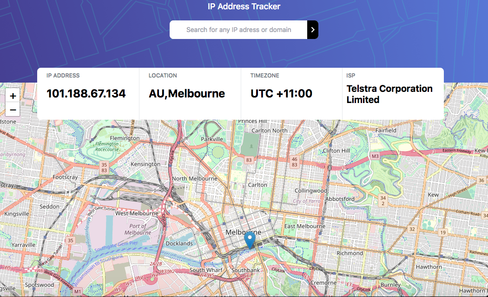

# IP ADDRESS TRACKER
 Check it out on <a href="https://ip-tracker-project-bs72.vercel.app/">Live</a>

# About Project
In this challenge, I use react-leaflet for the map and IP Geolocation API by IPify to get locations.
Users should be able to enter IP addresses and view the locations on the map

# Built With
- HTML 5
- Tailwind CSS
- React Js
- React-leaflet
- Free IP Geo Location

# What I learned
This project from frontend mentor has taught me how to use the react-leaflet 
and IP Geolocation to work with finding locations on maps

# To update 
- git clone 
- npm i 
- npm start

